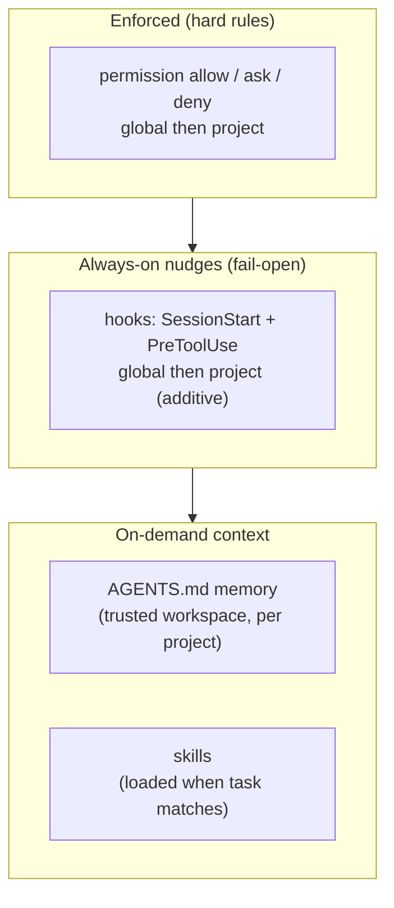

# User setup — what you need to do

This is your short, action-oriented checklist for setting up AI-assisted **SpaDES toolkit** development.
It groups the setup steps; the reference docs (`01`–`03`)
describe how the pieces work once you've configured them.

This and the other guideline documents assume the use of Posit Assistant, powered by Anthropic Claude models, but can be adapted to other AI interfaces. 

> **Who reads what.** This doc and `00b-user-guidelines.md` are the **user-facing**
> guidelines, written for you. The numbered `01`–`03` docs are **assistant-facing**
> reference the AI consults when a step needs detail (the `→ detail:` pointers). You remain
> responsible for the instructions and content the assistant is given, so read the `01`–`03`
> docs too: they define what the assistant is instructed to do on your behalf.

> **Team resources.** Guidelines, the `AGENTS.md` template, and the shared skills all
> live in one repo:
> - SpaDES.ai repo: https://github.com/CeresBarros/SpaDES.ai
>   (`git@github.com:CeresBarros/SpaDES.ai.git`) — `guidelines/`, `AGENTS.md`, `skills/`.

> **Working with the assistant day to day.** This file is about one-time setup. For *how*
> to work with the assistant once it's running — responsible use for scientific modeling,
> prompting habits, context management, and which commands transfer to other tools — see
> `00b-user-guidelines.md`.

## Steps

**Steps 1–2 are your decisions; steps 3–5 you can hand to the assistant** — see the
prompt examples at the end of this section.

0. **Before you start.** Have the software installed: **Positron** with **Posit
   Assistant** enabled, **R**, and — recommended but not required — **git** with a
   **GitHub** account. Without git/GitHub you can still download this repo (and the SpaDES
   toolkit repos) as a zip from GitHub; GitHub is not needed to *use* SpaDES. No R
   versions or R package lists to manage — the SpaDES tooling (`Require`,
   `SpaDES.project::setupProject()`, and each module's `reqdPkgs`) and the assistant
   handle package setup, as long as the installed R version can support latest SpaDES
   package versions.

1. **Choose and confirm the project folder.** Decide the working-directory path that
   collects your toolkit package repos side by side, and whether the assistant may read
   outside the project. → detail: `01-project-setup.md`.

2. **Confirm the repository set and fork situation.** List which toolkit packages are in
   scope (don't assume a canonical set), and record for each repo whether it is an
   upstream clone or a personal fork, plus the default branch (SpaDES repos are mixed —
   some `main`, some `master`). → detail: `01-project-setup.md`.

3. **Create project memory and install guardrails.** Ask the assistant to add an
   `AGENTS.md` at the project root (from the team template in SpaDES.ai) and to set up the two hook
   scripts and the `permission` rules in the global `settings.json`. Have it show the
   diff and get your sign-off before writing, and back up `settings.json` first; these
   changes only take effect in a **new conversation**, so be sure to save your progress and restart
   the conversation. → detail: `02-guardrails.md`; record
   the concrete files/paths installed on your machine in a local `*.local.md` companion
   (see "Local instances of these guidelines" below).

4. **Get the shared skills.** Ask the assistant to clone or sync the team skills repo
   into a local skills path (it needs permission to run `git` and write there); you
   decide the target path and confirm the skills are discoverable. Only create a new
   skill if a need isn't already covered. → detail: `03-skills.md`.

5. **Trust the workspace.** Accept the trust prompt so project memory, project
   settings, and project hooks load. → detail: `01-project-setup.md`.

## Example prompts for steps 3–5

Ask the assistant to do the setup. Prompts are tool-neutral; the right-hand column is a
Posit Assistant + Claude phrasing. Steps 1–2 stay your decisions — the assistant can
advise, but you confirm the folder and repo set. For any config-writing prompt, expect
the assistant to show a diff and get your sign-off first; guardrail and hook changes
apply in **new** conversations.

| Step | Generic prompt | Posit Assistant + Claude prompt |
| --- | --- | --- |
| 3 · Project memory | "Create a project memory file at the project root from the SpaDES.ai `AGENTS.md` template, adapting the paths and repo list to this workspace; show me the result before writing." | "Copy the SpaDES.ai `AGENTS.md` template into this project root as `AGENTS.md`, adapt the paths/repo list, and show me the diff before writing." |
| 3 · Guardrails | "Set up the reference guardrails from `02-guardrails.md` (permission allow/ask/deny rules plus the two hook scripts); show me the settings changes before applying." | "Set up the `02-guardrails.md` reference guardrails — the `permission` rules in `settings.json` plus the SessionStart and PreToolUse hooks — back up `settings.json`, and show me the diff before applying. (Takes effect in a new conversation.)" |
| 4 · Skills | "Fetch the shared SpaDES.ai skills into a local skills directory the assistant discovers, and confirm they are available." | "Clone (or sync) the SpaDES.ai `skills/` into `~/.agents/skills`, then confirm `spades-overview` is discoverable." |
| 5 · Trust workspace | "How do I trust this workspace so project memory, settings, and hooks load?" | "How do I trust this workspace in Positron so `AGENTS.md`, project `settings.json`, and project hooks load?" |

`~/.agents/skills` is the tool-neutral, cross-tool skills location (read by Posit
Assistant and other Agent-Skills-aware tools), which is why it's used here; for a
Posit-Assistant-only install, use `~/.posit/assistant/skills` instead. Both are
discovered by default — see `03-skills.md`.

## Local instances of these guidelines

The shared guidelines (`00`–`03`) are deliberately **path-agnostic**: they describe
*what* to set up and *why*, using only relative or `~`-style references. But actually
setting up a machine produces concrete details — absolute paths, the exact config values
merged into your `settings.json`, backup filenames, which repos live where, and
verification that it all works. Those details are **machine- and user-specific** and do
not belong in the shared docs.

The convention for capturing them:

- **Keep a local companion file** for each shared doc whose setup you instantiate,
  recording the concrete result on your machine. Name it after the doc it instantiates
  with an `a` suffix and a `.local.md` extension, sitting beside it — e.g.
  `02a-implemented-reference.local.md` is the local instance of `02-guardrails.md`.
- **Keep them out of the shared guidelines.** Local instances sit alongside the workspace
  but are never published with the shared docs, so one person's paths and setup never
  enter the artifact everyone shares. The `.local.md` suffix marks them as such, and the
  SpaDES.ai `.gitignore` excludes `*.local.md` so they are not committed by accident.

This mirrors how Posit Assistant already separates shared from personal elsewhere:
`AGENTS.md` is project-scoped and loads only in a trusted workspace (there is no shared
global memory), and skills separate the shared team set from personal
`~/.posit/assistant/skills/` ones. The `.local.md` convention applies the same instinct
to the guidelines themselves — shared spec, local instantiation, personal parts kept out
of the common artifact.

> **Caution.** Because local instances are kept out of the shared guidelines, they are
> invisible to teammates and easy to forget or lose when you change machines. Treat each
> one as a personal record to **recreate per machine**. And if, while writing one, you
> discover something genuinely reusable (a better default, a clearer step), lift it
> **back up** into the shared path-agnostic doc — otherwise useful knowledge gets
> stranded where teammates never see it.

## How the guardrail layers fit together

The schematic below shows what each layer contributes and the order things resolve.
Enforced rules (permissions) sit above always-on nudges (hooks), which sit above
on-demand context (memory, skills).

Resolution order for a given action: conversation-scoped approvals → project approvals →
project config → global config → built-in security defaults → tool default (`ask`).
Hooks are additive (global then project) and never override each other.
